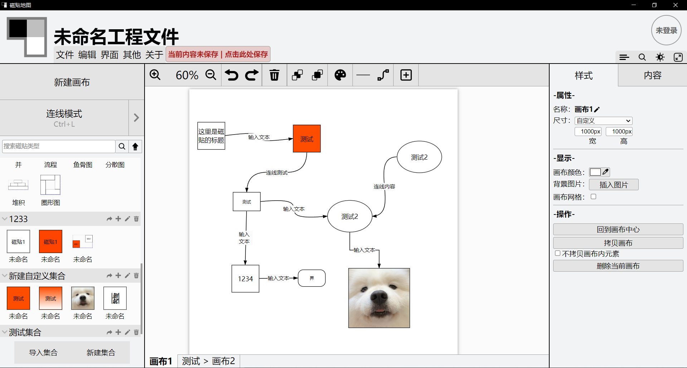
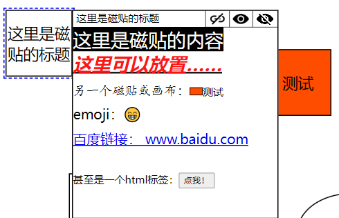
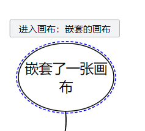
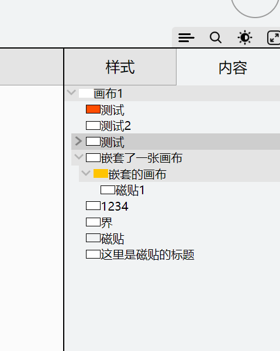

# 磁贴导图 TileMap

一款JS全栈的pc端思维导图设计软件，特点包括：  
	1.提供了画布嵌套功能与相应的功能支持。  
	2.以缩略信息的磁贴导向，包含详细信息的磁贴内容，支持更多样化的信息表达  
	3.支持内容导出为可直接引用的html文件

框架：jquery → vue3 + nodejs + electron   
语言：h5 + css→scss + js→ts  
平台：PC端
类型：应用程序

前排提示：该项目目前已经暂停，需要等待后续的重构与Bug修复。

---

# 目录

-[项目介绍](#项目介绍)  
-[使用文档](#使用文档)  
-[杂谈](#杂谈)

# 项目介绍

## 项目总预览图

如图所示，这是一款结构工整的思维导图设计软件。实现了绝大部分思维导图设计功能，在此基础上进行了诸如画布嵌套等功能的拓展。

## 项目内容

详细设计内容请参见下方的使用文档，此处重点介绍项目的特色功能。

### 1.磁贴内容

市面上的绝大部分思维导图用起来都太不顺手了，其中最让我头痛的地方莫过于：一旦我希望用思维导图来整理稍多一些的资料，整个页面就会变得一团乱麻！  
但如果只是简单地整理思路我又为什么不使用纸和笔？  
这个功能诞生自这样的需求。除了直接显示在页面上的磁贴以外，每个磁贴都有一个绑定+响应式的磁贴内容，以供给用户为这个磁贴添加更详细，更复杂的文本内容。

虽然本质是一个富文本编辑器，但也适配了加入磁贴或画布的功能（点击跳转到对应磁贴/画布），使用场景集中于需要对思维导图中的对象进行中等信息量的讲解或解释，由于是响应式（也可以设定为持续显示，看右上角的三个按钮）所以也不会影响到思维导图常态显示时的信息密度。

### 2.画布嵌套

虽然磁贴内容解决了一部分问题，但新的问题总是层出不穷。如果我的导图规模进一步扩大，亦或者导图的内容之间也有逻辑上的关联需要进行分类，那富文本编辑器肯定不堪就用了。  
画布嵌套的需求应运而生

也在此功能上做出了一定的适配，例如层叠关系的显示

### 3.导出为HTML

既然项目前后端都是js，所有逻辑也是js实现的，那能够导出一个HTML文件直接嵌入网页中使用也很合理吧？
不过可惜的是本功能目前没有得到十分完善的实现（主要有一些依赖包没能完全解绑，等换用了vue框架之后会好很多），还有一大堆令人脊背发凉的bug需要修复，这里就暂时不介绍了。

# 使用文档

这里写不下：[点击查看学术垃圾](文档/详细设计)

注意：上述内容均基于重构前的项目，有一定时效性。

# 杂谈

1.该项目是我个人的毕业设计，文档则是从我的毕设论文中截取的一小部分，此处致敬我自己。  
2.该项目起初是打算使用vue3框架实现的，但是我导师不让，原生h5做着有多难受就不谈了。害得我现在还要重构，一怒之下怒了一下。  
3.右上角的登陆注册的账号功能，由于我的服务器被征用干别的了所以目前无法使用，不过其功能也就仅限上传下载文件和头像，***并没有实现设计中的在线合作设计功能***（即使实现了大概也没钱买这么高性能的服务器吧）。  
4.即使是这样如果你都想下载来使用一下的话，可以在clone库之后在命令行中启用`npm start`打开（需要electron生产环境支持）
